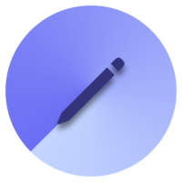

<!--BarNotes Logo -->

<div align="center">
	<a href="https://dextercode.craft.me/BarNotes">
		
	</a>
	<h1>BarNotes</h1>
	<p>
		<b>Tiny notes app in your menubar</b>
	</p>
	<br>
</div>

<!--Downloads-->
## Download
<a href="https://apps.apple.com/in/app/barnotes/id6744329261?mt=12" target="_self"></a>

### Non-App Store version

A special version for users that cannot access the App Store. It won't receive automatic updates. But I will update it here whenever new version releases.

[Download](https://github.com/DexterDotCode/BarNotes/releases/tag/v1.1) *(1.1 • macOS 14+)*


> [!IMPORTANT]
> - On initial launch, Apple will asks for your system password to access keychain because BarNotes store your notes securely in keychain. 
> - After Entering password click on 'Always Allow' to avoid this popup on every app launch.

<!-- Features -->
## Features
BarNotes is designed for people who value both simplicity and security.

- **Built for Real Work:** Whether you're capturing meeting notes, managing daily tasks, or brainstorming ideas, BarNotes provides instant access without disrupting your workflow. No bloated features—just fast, reliable note-taking exactly when you need it.
- **Thoughtfully Crafted Experience:** Choose from multiple themes and typography options that suit your needs.
- **Security-First Architecture:** Your notes are protected with iCloud Keychain encryption, making BarNotes suitable even for sensitive information like passwords. Your data remains private and accessible only to you.


<!--BMAC-->
## Buy Me A Coffee
<a href="https://www.buymeacoffee.com/dextercode" target="_blank"></a>

<!--Installation and Instructions-->
## Installation

1. **Clone the Repository**:
   ```bash
   git clone https://github.com/DexterDotCode/BarNotes
   cd BarNotes
   ```

2. **Open the Project in Xcode**:
   ```bash
   open BarNotes.xcodeproj
   ```

3. **Build and Run**:
   - Select your target device.
   - Click the "Run" button or press `Cmd + R`.
   - Start taking notes
    
## Terms & Privacy
- Everything you enter in the app is stored on your device, and synced to your other devices using your iCloud keychain. 
- BarNotes does not display any advertisements, or include any trackers or analytics.

## Other apps
- [Compose Notes](https://apps.apple.com/in/app/compose-notes/id6743021076) - Beautiful note taking app for iPhone and iPad
